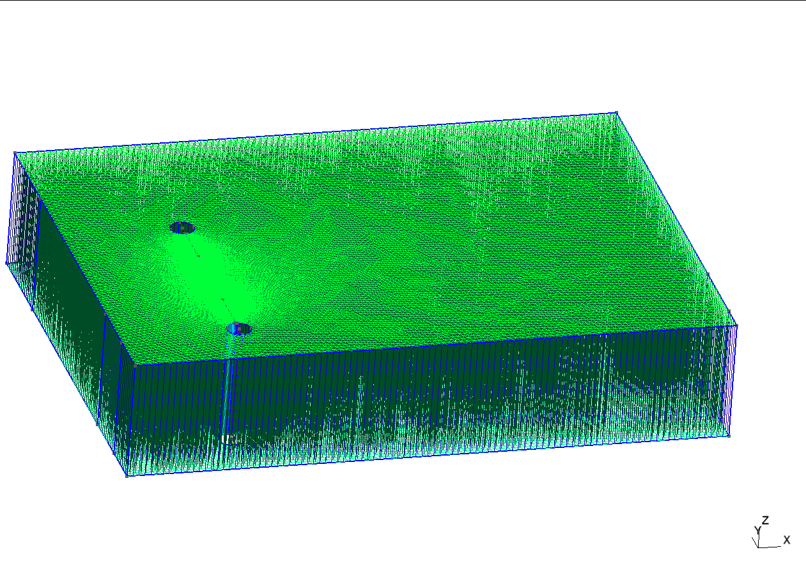

# OpenFOAM

* version: 2112 base-default
* machine d'exécution: Gaya
* commande de lancement en parallèle: `mpirun -np 4 nom_solveur -parallel > log`
* *But*: simuler transport de polluants -> coupler modèles CFD (Navier-Stokes) et ADR (transport) 

## Géométrie

* Bureau 228 à l'UFR contenant 2 personnes (1 femme et 1 homme) assises vis-à-vis
* Conversion du maillage en utilisant la commande `gmshToFoam`

[[figure1]]

[[figure2]]

[[figure3]]
